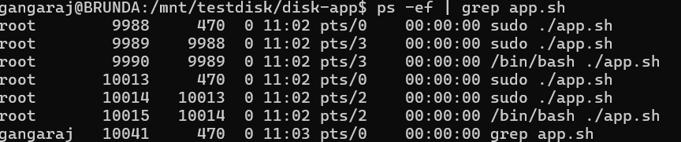
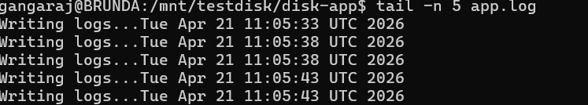
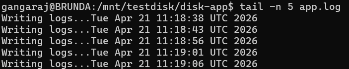

# Linux Incident - Disk Full Causing Application Failure

## Scenario
Application stopped functioning even though the process was running.

## Problem
Logs were not being written and application behavior was inconsistent.

## L1 Investigation
- Checked process → running
- Checked logs → write errors observed
- Checked disk → 100% usage

## L2 Investigation
- Identified disk full condition
- Application unable to write logs due to no available space

## Commands Used
See commands.txt

## Root Cause
Disk full prevented application from writing logs, causing functional failure.

## Fix Applied
Removed unnecessary large files to free disk space.

## Verification
- Disk usage reduced
- Logs started writing again
- Application functioning normally

## Screenshots

