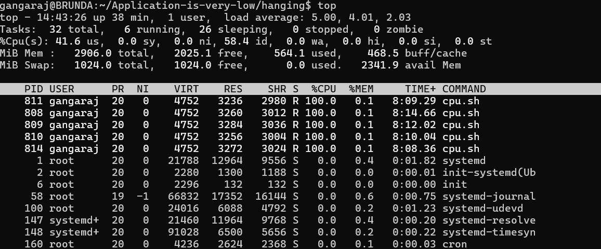
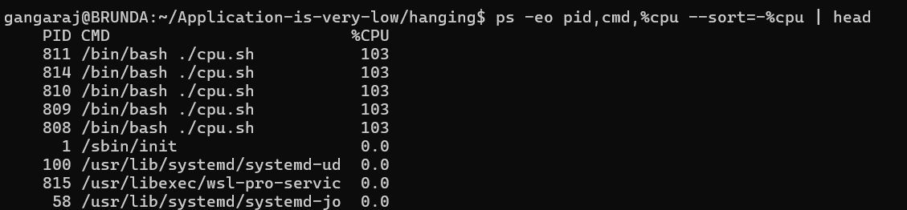
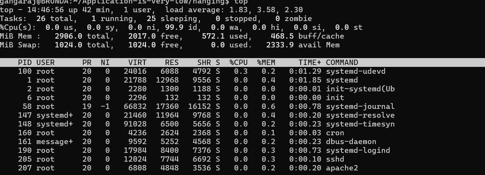

# Linux Incident - High CPU Causing System Slowness

## Scenario
System became slow and unresponsive.

## Problem
High CPU usage impacted system performance.

## L1 Investigation
- Checked CPU using top
- Observed high CPU usage

## L2 Investigation
- Identified multiple cpu.sh processes consuming 100% CPU
- Verified using ps command

## Commands Used
See commands.txt

## Root Cause
Infinite loop script consuming CPU resources

## Fix Applied
Killed high CPU processes

## Verification
CPU usage returned to normal

## Screenshots

